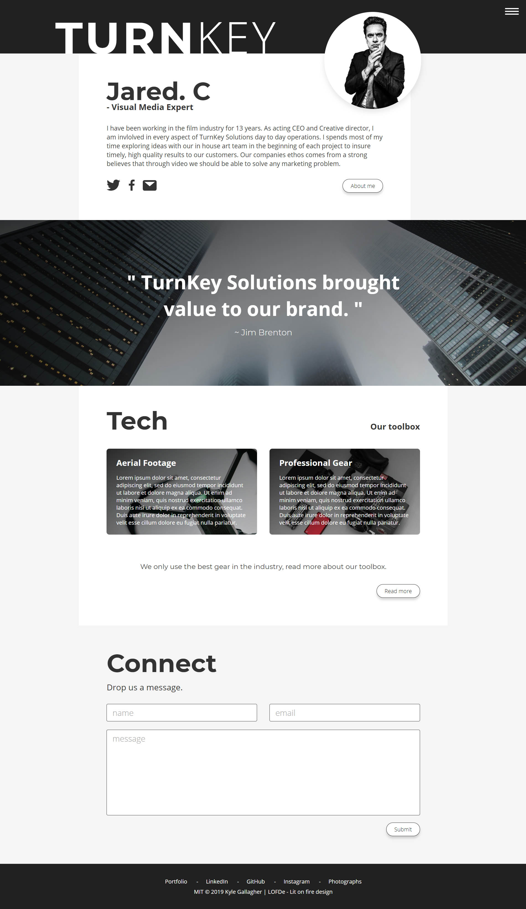

# WebDev SandBox
## Great for an easy HTML / SCSS / JS Sandbox environment.
This boilerplate is for a standerd html/css/js build without any frameworks. Webpack +UglifyJs to minify and bundle all files. The dev environment is run in the webpack dev server, all files are moved ( even images ) to a production folder upon building and are hosted in ram during the dev server.

- Best practices example project
- JS / CSS / HTML, minification
- Image name hashing for cache
- SCSS
- Auto prefixer
- SVGuse polyfill for SVGsprite imports browser support.
- Live Server
- Babel so you can write Javascript ES.Next
- Babel polyfill ( env ) only uses polyfills that you require based on the supported browsers in package.json for smaller and more optimized production builds.

## Plans?

- [ ] Automatic image optimizations with Webpack. ( for now the example is just using remote images from unsplash )
- [ ] Add an example for SVGuse sprite usage instead of inline svg ( currently inline )

# Commands

## Install dependencies
Install the needed node modules 
### `npm install`

## Run development live server
Put all of your files in the src folder based on the examples structure 
### `npm start`

## Build development files
This is so you can look at the files in the ./dist folder to explore your code without minification 
### `npm dev`

## Build production files
Build a minified production version of your app that will be in the ./dist folder 
### `npm run build`

## Example Project Included
The example project shows how simple and quickly you can get working with this boiler plate to produce high quality html, css, js projects. To get working in the example project run `npm install` then `npm start` and the webpack dev server will launch in your default browser.

## About the example files?
View the example design on CodePen: https://codepen.io/litonfiredesign/full/BbXZPa 

The design is fully responsive, It should yield great results down to widths of 325px and respond properly upwards to 4k. The example page is designed with user accesablility in mind. The exampple page will resize when you zoom in or out so that you can still view the page contents clearly zoomed in at 500x zoom. Changing your default browser font size will also create the appearance of a zoomed page by increasing all page sizing with the font size increase ( or visa versa ). Proper animations for tabbing have also been applied. This example is a good one for beginners to help illustrate some "best practices" such as using the BEM ( "Block Element Modifier" ) method, User accesability, File seperation and imports with SCSS. This could also help a new developer learn webpack, babel, ES.Next and NPM.

## Other boilerplates  
### Boilerplate for react full stack development with Nextjs:
https://github.com/slaterbbx/fullstackinator

## License
MIT License | Fullstackinator © 2019 Kyle Gallagher
